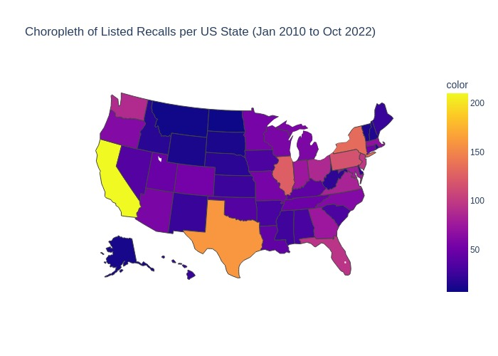

# 202212-32-Food-Recalls
### 202212-32

## Visualization and Analysis of Food Recalls
### EECS E6893: Big Data Analytics Fall 2022
Group 32\
Nathan Ma

## Project Introduction
This project aims to extract meaningful text features from food recall report webpages listed by the US FDA and FSIS, to augment existing tabular data. This data can be used to identify trends in food recalls, allowing users to textually query then visualize distributions or patterns in recalls. This ultimately allows users to make more informed decisions about the food they purchase, which can prevent some of the millions of cases of people getting sick or dying from foodborne illnesses each year.

[Data Collected and Used (Requires LionMail)](https://drive.google.com/drive/folders/1Oc26bdlAPJln8gnjE_aZNBsIk-ORqANk?usp=sharing)

## To Run Code
### Dependencies
The following packages need to be installed to run the code. They can be installed with `pip install`. Some may already be installed (especially if using Google Colab environment)
* numpy
* matplotlib
* pandas
* google-colab
* reqeusts
* bs4
* plotly
* kaleido

### Notebooks
The data preparation and gathering is done in `Data_Preparation.ipynb`. This process can be recreated in the notebook. By executing the cells to make all the http requests, the user can reproduce the gathering of all the raw html data (not recommended due to long runtime). The cells to process the html data into extracted text data features can also be used to reproduce this process of formatting then parsing the text data (also not recommended due to long runtime). These cells are commented as only to be run once. Alternatively, the user can simply use the pre-saved data files to view the html and text data already processed.

### Visualizations

